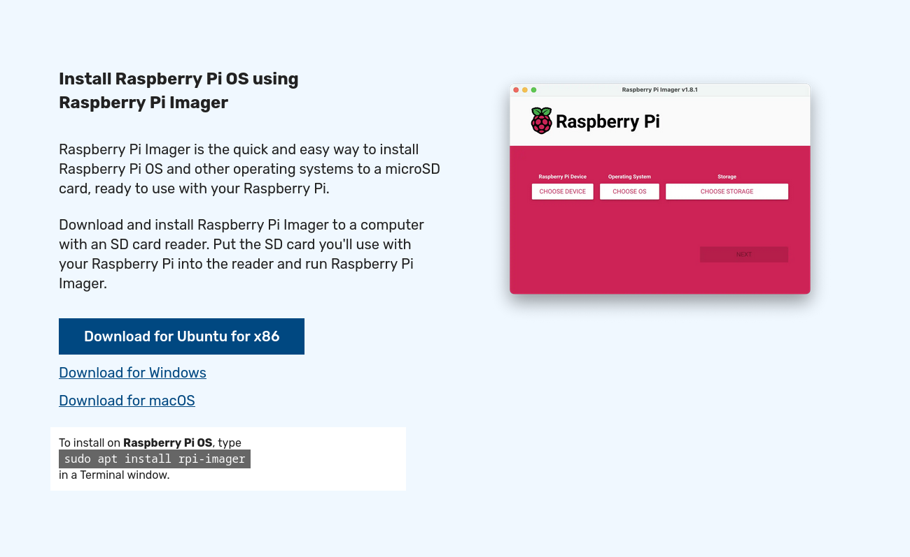
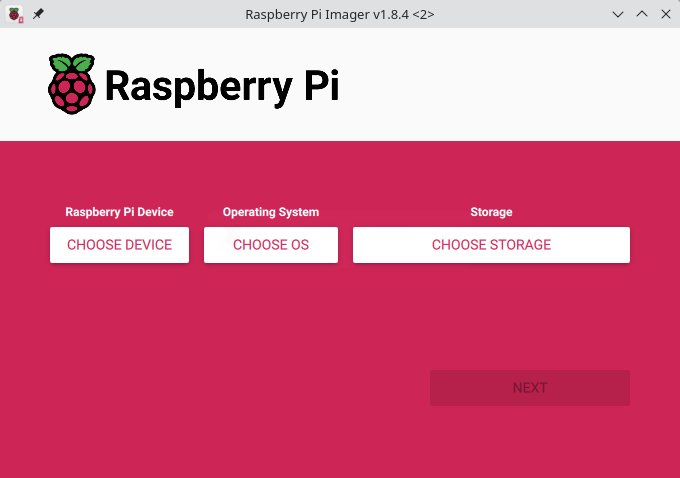
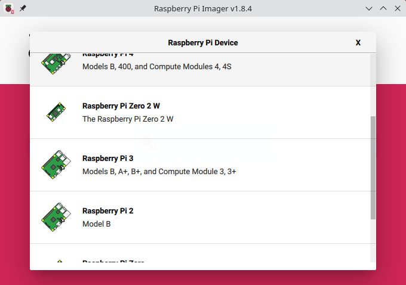
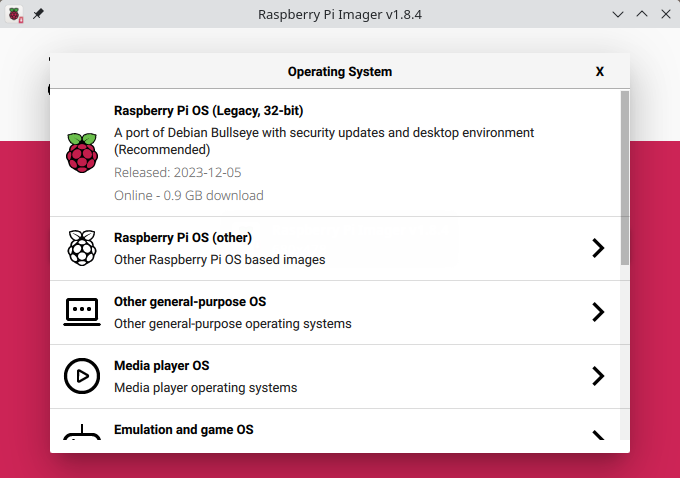
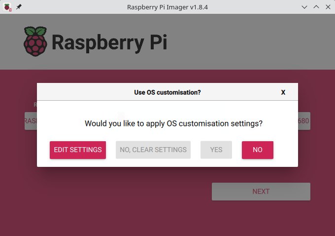
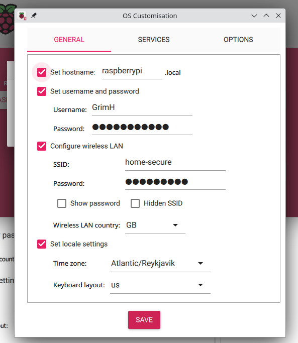
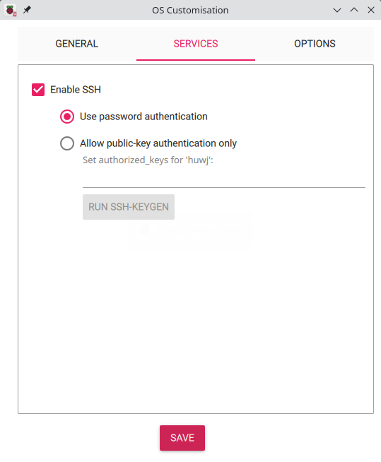
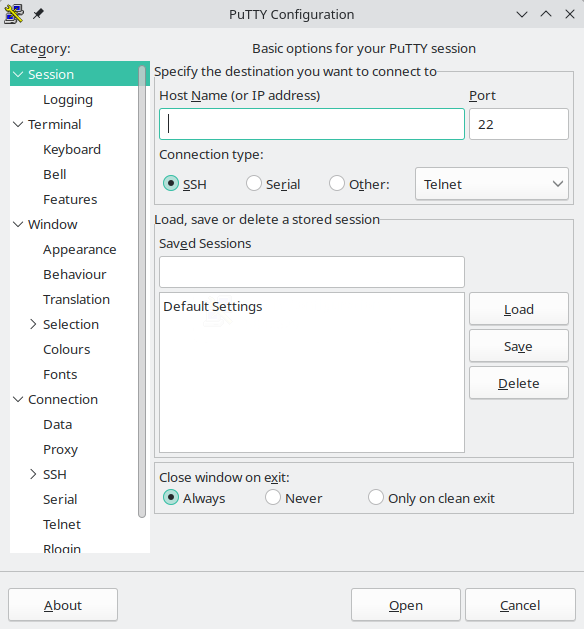
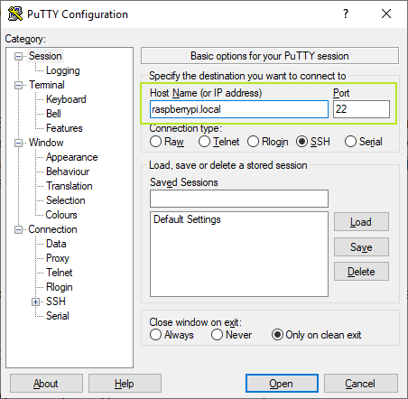

=========================
Pi Zero 2 W Headless Setup
=========================

A `Pi Zero 2 W <https://www.raspberrypi.com/products/raspberry-pi-zero-2-w/>`_ is your pocket sized little brother of the `Raspberry Pi <https://www.raspberrypi.com/>`_.

An even smaller Single board computer, it can be used for a lot a fun little projects such as:

* A  small form factor `WiFi extender <https://hackaday.io/project/171296-truly-wifi-extender>`_. 
* A mini `ad-blocker using Pi-hole <https://pi-hole.net/>`_.
* A fun `video looper <https://alexasteinbruck.medium.com/how-to-configure-your-raspberry-pi-zero-to-play-videos-in-a-loop-cheap-and-flexible-solution-for-42f7744ed5c5>`_.
* `Many many others <https://hackaday.io/projects?page=1&tag=raspberry%20pi%20zero>`_.

Due to its small form factor, and comparatively weak HDMI signal, it's practical, even desirable, to set up a pi zero without a monitor using its headless features. 
This document serves as a guide to precisely that process. 

Step 1. Acquiring your Operating System
=======================================

Generally, Raspberry Pi products run their OS from the micro SD card kept in the slot. 
So, before starting your Pi Zero up, you need to flash the OS to an SD card.

This process uses the Raspberry Pi OS, for the sake of simplicity:

1.  Go to the `Pi software page <https://www.raspberrypi.com/software/>`_ and download and install the Raspberry Pi imager: 

2.  Open it to begin the image flashing process:

3. Click `Choose Device` and select `Raspberry Pi Zero 2 W`

4. Click `Operating System` and select the recommended OS suggested by the imager.

5. Select next to open the `Use OS customisation?` prompt, and select `Edit Settings`.

    
6. Check the `Set username and password`, `Configure wireless LAN`, and `Set locale settings` boxes, and input the correct details.
   
   * Under `Configure wireless LAN` input the name of the wireless network under `SSID` and the password for that network.
   * This will be necessary for the headless setup process.

7. Open the `Services Tab` and check `Enable SSH` and select `Use password authentication`.

8. Click `Save` on the edit customisation popup, and then `Yes` on customisation prompt.

9.  Confirm that you want the SD card to be written to and formatted, and wait for the process to finish.

10.  Remove the SD card when prompted.

Step 2. Installing Your OS
==========================

This process is relatively simple; insert SD card into the Pi Zero W's SD card slot and plug it in to start it up. 

As it starts up, it will set up Raspberry Pi OS according to the settings defined in the OS customisation.

Step 3. Connect to the Raspberry Pi Zero 2 W with SSH
=====================================================

The Pi Zero will connect to the WiFi automatically due to the set up in `Step 1 <Step 1. Acquiring your Operating System>`_. 

Now, take another computer and start it up. As long as both this PC and the Pi zero are on the same WiFi, you can can access the Pi using SSH.

To use SSH, you first need to install `Putty <www.putty.org>>`_, an SSH client. 

To install on Windows, download the `installer <https://www.chiark.greenend.org.uk/~sgtatham/putty/latest.html_>`_. 
For Linux, see `these installation instructions <https://www.ssh.com/academy/ssh/putty/linux>`_, and follow `these instructions <https://www.ssh.com/academy/ssh/putty/mac>`_ for Mac.

To use Putty to set up your headless Zero 2 W: 

1. Open Putty, to bring up the start up page. 

   * At this point, Windows will probably generate a security prompt, Click `Ok` to continue.
   * Linux and MacOS may prompt you similarly.

1. Ensure the `SSH` field is selected an input `raspberrypi` in the `Host Name (or IP address)`. Then click `Open`. (The port will default to `22`).

2. Enter the username and password defined in Step 1.

This will open the Command line interface of your Pi Zero 2 W. Next, we need to enable VNC, to get to the UI.
