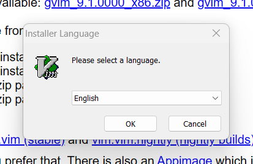
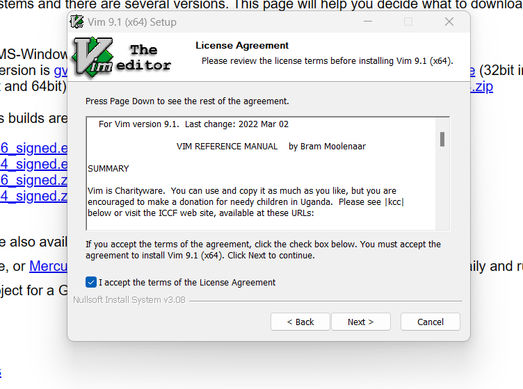
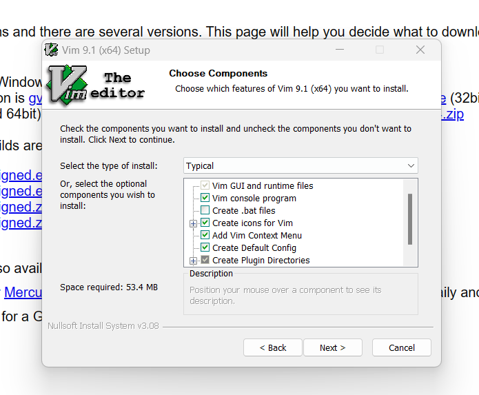
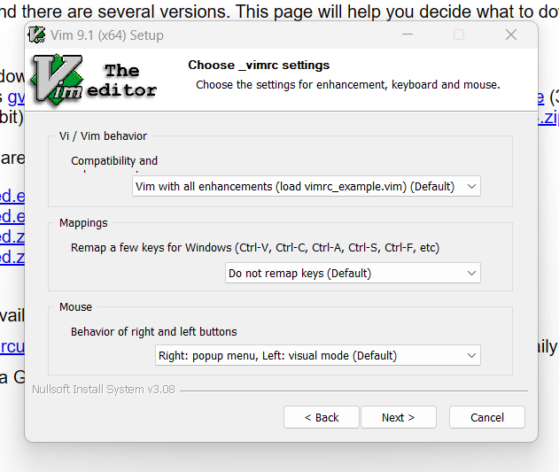
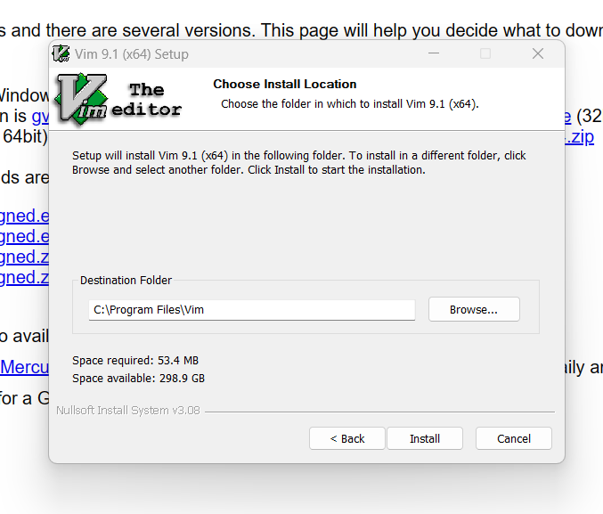
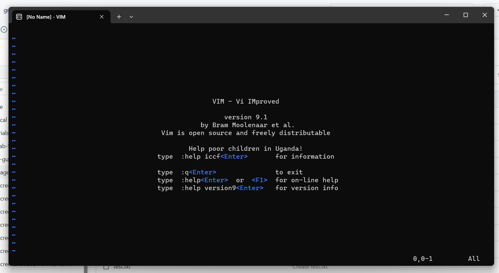
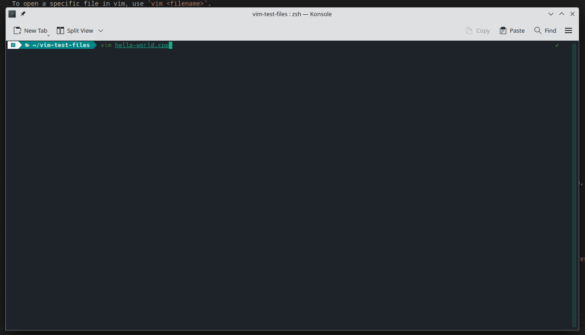
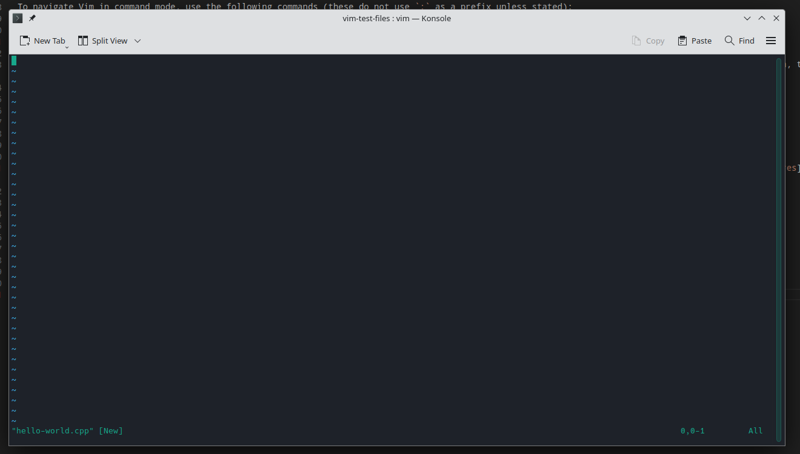
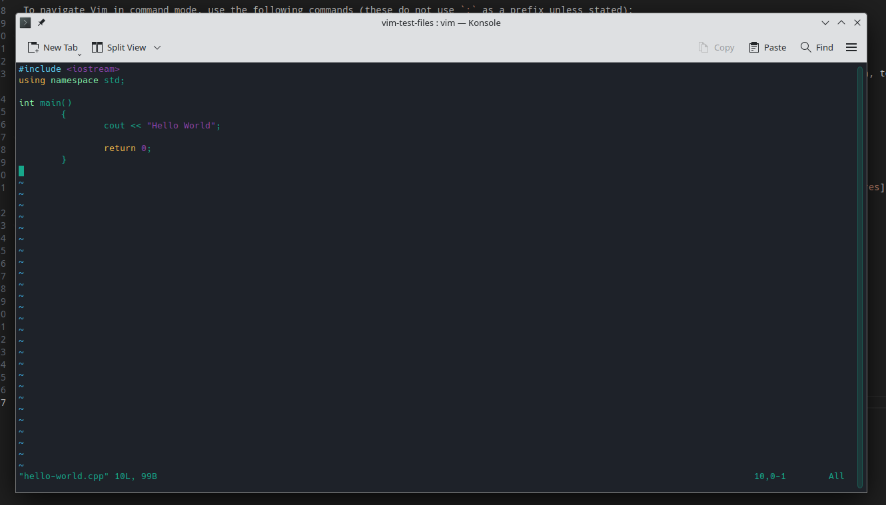

= Vim - A Beginner's Guide (WIP)

Vim, or vi improved, is an open-source text editor which is favoured by experienced many engineers and developers due to its minimal interface and features that allow for fast coding.

Vim has a steep learning curve, but once mastered, can serve as a quick interface for updating code from your command line terminal. 

This guide serves as a beginner's introduction to installing, navigating, and using Vim for coding. 

== Installation

Depending on your operating system, Vim may already be installed "out of the box" on your system. To test this open your terminal and input the following command:

[source, shell]
----
vim --version
----

If vim is already installed, you will receive a terminal printout along these lines:

[source, shell]
----
VIM - Vi IMproved <version number> (<Today date>, compiled <date compiled> <time compiled>)
Included patches: 1-2167
Compiled by <Your OS>

----

Followed by a features list, with your included features marked with `+`, and excluded features marked with a `-`.

If your system does not have vim installed, your terminal will return a message resembling `vim command not found` or `command not found "vim"`. 
In this case, follow the relevant following chapter to install vim on your system. 

=== Installing Vim in Windows

In Windows, it is easiest to install Vim from an [executable file (.exe)](https://www.techtarget.com/whatis/definition/executable-file-exe-file). 
Download the relevant executable file from the [Vim downloads page](https://www.vim.org/download.php), and double-click to run it. 

The system will  probably prompt you with a permissions prompt, accept this to continue. 

Vim will now open a Windows installation wizard, beginning with a select language prompt page. 

Select the language and the first wizard page will appear showing a basic landing page, click `Next` to continue.

image::images/vim-wizard-page-1.png[]

The wizard will open a license agreement, read it, check the `I accept the terms of the License Agreement` box, then click `Next`.

On the next page, you will be prompted to select which features of Vim you want to install. I recommend you keep the components that are selected as standard. Click `Next` to continue. 

Next, the Vim wizard will ask you to choose its settings. Once again, I recommend you stay with the standard settings, and simply click `Next`.

Next, select the location for the programme files to be stored. Again, the default setting is likely the best setting, so I recommend clicking `Next`.

The final page, confirms you have installed Vim on Windows. Congratulations! Click finish to end this process.

image:::images/vim-wizard-last-page.png[]

Open your start menu, type `Vim` to find Vim an open it. It will open in a Powershell environment as seen below.

=== Install Vim on MacOS

Vi is included as standard in the command line of MacOS. However, to get the full feature set of Vim, I suggest installing the open-source project [MacVim](https://macvim.org/).

There are two ways to install MacVim: 

- Using a downloadable `.dmg` executable.
- Installing in the command line using Homebrew. 

==== Install With an Executable File

To install with a `.dmg` file: 

- Open the [MacVim homepage](https.://macvim.org/)
- Click `Download MacVim`.

- When the `.dmg` is downloaded, double click it to open the application installation page.

- Drag and drop the MacVim icon into `Applications`.
- Open launchpad and search `MacVim`.
- Open it and the page will open at the Vim startup page.

==== Install With Hombrew

To install using [Hombrew](https://brew.sh/):

- If not installed already, open your Mac Terminal and input the following to install Homebrew:

[source, shell]
----

/bin/bash -c "$(curl -fsSL https://raw.githubusercontent.com/Homebrew/install/HEAD/install.sh)"

----

- Next install the command line version of MacVim with this command:

[source, shell]
----

brew install macvim

----

- Ensure the installation worked by entering the following to check the version:

[source, shell]
----

mvim -v

----

- If the version is returned, MacVim is successfully installed. Open it with `mvim`.

=== Install on Linux

Naturally, Linux installation of vim depends on your distribution and package manager.

As noted before, there is a reasonable chance that vim was included with the Linux distribution on install. This can be tested with the `vim --version` command listed above in [the installation section](#installation).

Use the following command line commands to install Vim if it is not present:

- On Debian based distributions:

[source, shell]
----

sudo apt install vim

----

- On Fedora based distributions:

[source, shell]
----

sudo dnf install vim

----
- Arch Linux based distributions

[source, shell]
----

sudo pacman -S vim

----

- On OpenSUSE:

[source, shell]
----
sudo zypper install vim
----

This will begin the installation. After installation use `vim` in your terminal command line to open a blank document in Vim.

To open a specific file in vim, use `vim <filename>`.

== Using and Navigating Vim

Vim uses a series of commands to operate in its standard mode, and is noted for being hard to quit once installed and opened. 

To enter all of these commands first type `:` to open the command input at the bottom of Vim. 

The basic commands to use when first using Vim are:

* `:q`: Closes the open Vim and file.
** If you have made changes, Vim will refuse to quit, use `:wq` to save these changes and quit.
** IF you want to discard these changes use `:q!`.
* `:w`: Saves the current file, with `w` meaning "write".
* `x`: Like `qw`, this will write the file, then quit.

To navigate Vim in command mode, use the following commands (these do not use `:` as a prefix unless stated):

* `i`: Go to insert mode, enabling you to input and edit code. While input mode is active, Vim will display `-- INSERT --` in the bottom left.
** Press `Esc` to leave input mode, and return to command mode.
* In command mode, navigate around a file using `h` (left), `j`(down), `k` (up), and `l`(right).
** The standard keyboard arrow keys also work in the same way, but this navigation keeps your fingers on the middle line of your keyboard, by design, to enabling faster coding.
* Press `w` to move to the next word and `B` (capital necessary) will move you back a word.
* Press `b` to move to the beginning of a word end `e` to move to the end of a word.
* Similarly press `0` to move to the start of a line amd `$` to move to the end of a line.
* Type `:` then a number to jump to that numbers line in the editor, for example `:160` will jump to line 160.
** An equivalent command is `160G`, which has the same effect.
* Press `gg` and `G` to move to the first and last line of a file respectively.

There are many more commands, but these are the basic ones you need to know. To get used to this navigation mode, you can use the website https://vim-adventures.com/[Vim Adventures], which is an adventure game that teaches you to instinctively use the Vim navigation tools.

== Using Vim to Make and Edit Code

To make a file in vim, open your desired repository in a terminal, and input `vim <file name>`.

This will open a new blank file, in command mode.

Press `i` to go into insert mode, and type your code. 

Press `Esc`, then `:w` to save your changes. 

To edit pre-existing code, stay in command mode and use the following keys and shortcuts:

* Press `dd` to delete the current line. This also cuts the content to the clipboard.
* Press `yy` to copy ("yank") the current line.
* Press `p` to paste copied or cut content to the line your cursor is on.
* Press `P` to paste the copied or cut content to the line below your cursor.
* Press `u` to undo your last change, this includes changes made in command and insert mode.
* Press `U` to undo all recent changes on the line your cursor is currently on.

When finished, type input the `:wq` or `:q` command to close your file, and Vim itself.

== Conclusion

By following this guide, you have become a beginner user of the powerful, if difficult, Vim.
To improve your Vim skills further, visit the https://www.vim.org/docs.php[Vim documentation site], or use the `vimtutor` command in your terminal.