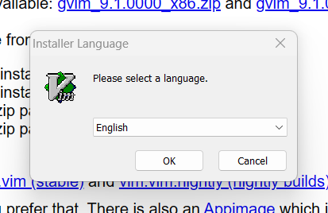
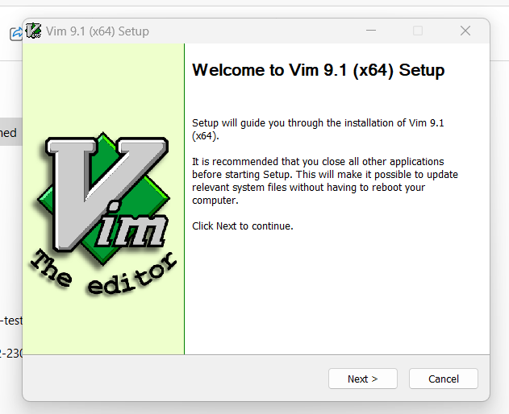
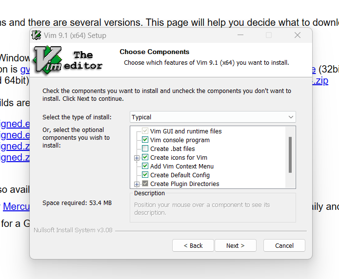
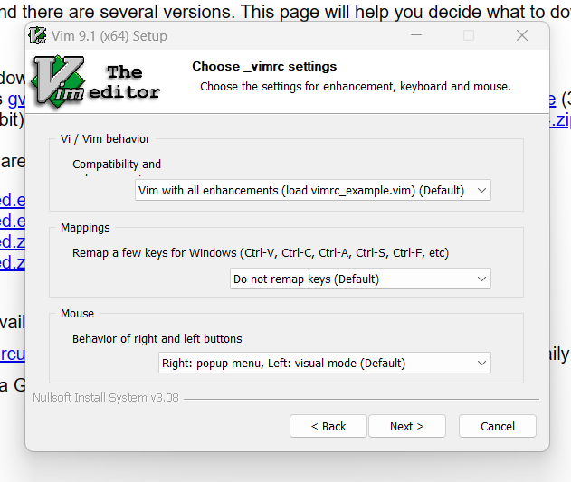
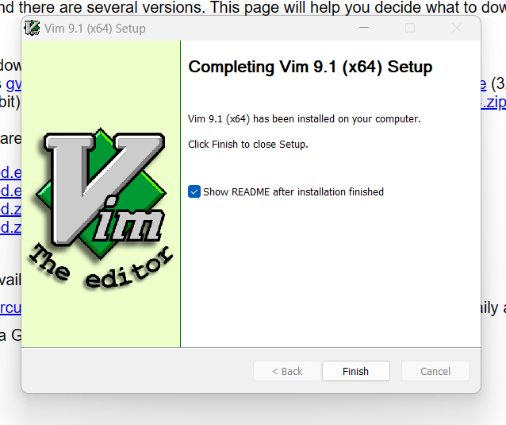
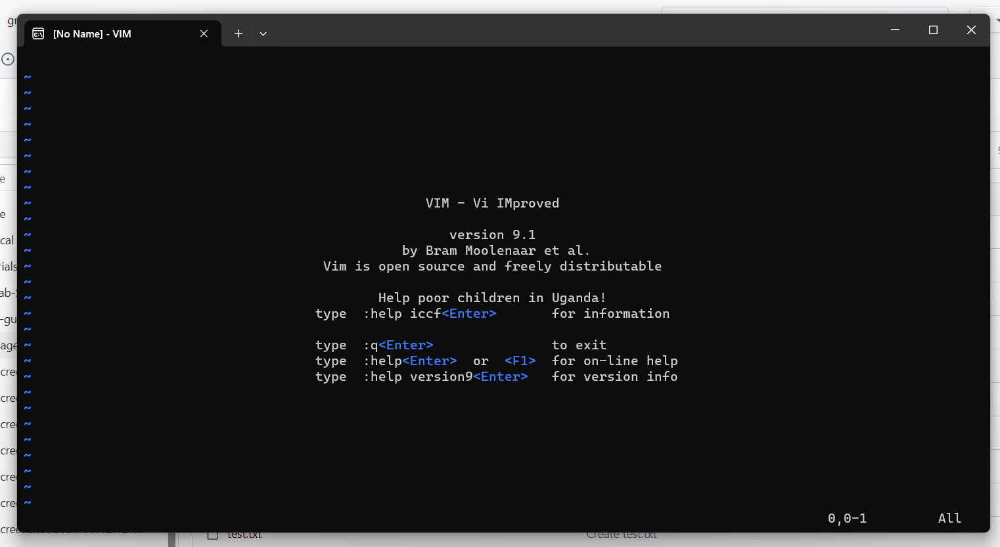

#  Vim - A Beginner's Guide (WIP)

Vim, or vi improved, is an open-source text editor which is favoured by experienced many engineers and developers due to its minimal interface and features that allow for fast coding.

Vim has a steep learning curve, but once mastered, can serve as a quick interface for updating code from your command line terminal. 

This guide serves as a beginner's introduction to installing, navigating, and using Vim for coding. 

## Installation

Depending on your operating system, Vim may already be installed "out of the box" on your system. To test this open your terminal and input the following command:


````sh
vim --version
````

If vim is already installed, you will receive a terminal printout along these lines:

````sh
VIM - Vi IMproved <version number> (<Today date>, compiled <date compiled> <time compiled>)
Included patches: 1-2167
Compiled by <Your OS>
````
Followed by a features list, with your included features marked with `+`, and excluded features marked with a `-`.

If your system does not have vim installed, your terminal will return a message resembling `vim command not found` or `command not found "vim"`. 
In this case, follow the relevant following chapter to install vim on your system. 

### Installing Vim in Windows

In Windows, it is easiest to install Vim from an [executable file (.exe)](https://www.techtarget.com/whatis/definition/executable-file-exe-file). 
Download the relevant executable file from the [Vim downloads page](https://www.vim.org/download.php), and double-click to run it. 

The system will  probably prompt you with a permissions prompt, accept this to continue. 

Vim will now open a Windows installation wizard, beginning with a select language prompt page. 



Select the language and the first wizard page will appear showing a basic landing page, click `Next` to continue.



The wizard will open a license agreement, read it, check the `I accept the terms of the License Agreement` box, then click `Next`.


On the next page, you will be prompted to select which features of Vim you want to install. I recommend you keep the components that are selected as standard. Click `Next` to continue. 



Next, the Vim wizard will ask you to choose its settings. Once again, I recommend you stay with the standard settings, and simply click `Next`.



Next, select the location for the programme files to be stored. Again, the default setting is likely the best setting, so I recommend clicking `Next`.


The final page, confirms you have installed Vim on Windows. Congratulations! Click finish to end this process.



Open your start menu, type `Vim` to find Vim an open it. It will open in a Powershell environment as seen below.



### Install Vim on MacOS

Vi is included as standard in the command line of MacOS. However, to get the full feature set of Vim, I suggest installing the open-source project [MacVim](https://macvim.org/).

There are two ways to install MacVim: 

- Using a downloadable `.dmg` executable.
- Installing in the command line using Homebrew. 

#### Install With an Executable File

To install with a `.dmg` file: 

- Open the [MacVim homepage](https.://macvim.org/)
- Click `Download MacVim`.


- When the `.dmg` is downloaded, double click it to open the application installation page.

- Drag and drop the MacVim icon into `Applications`.
- Open launchpad and search `MacVim`.
- Open it and the page will open at the Vim startup page.


#### Install With Hombrew

To install using [Hombrew](https://brew.sh/):

- If not installed already, open your Mac Terminal and input the following to install Homebrew:

````sh
/bin/bash -c "$(curl -fsSL https://raw.githubusercontent.com/Homebrew/install/HEAD/install.sh)"
````

- Next install the command line version of MacVim with this command:

````sh
brew install macvim
````

- Ensure the installation worked by entering the following to check the version: 

````sh
mvim -v
````

- If the version is returned, MacVim is successfully installed. Open it with `mvim`.

## Install on Linux

Naturally, Linux installation of vim depends on your distribution and package manager. 

As noted before, there is a reasonable chance that vim was included with the Linux distribution on install. This can be tested with the `vim --version` command listed above in [the installation section](#installation). 

### Debian Based Distributions

Debian, Linux Mint, Ubuntu, and other Debian based distributions use the [Advanced Packaging Tool](https://wiki.debian.org/Apt) for package management. 

Install vim from the command line with this command:

````sh
sudo apt install vim
````
This will begin the installation. After installation use `vim` as a command to open a blank document in Vim.

To open a specific file in vim, use `vim <filename>`.

### Fedora Based Distributions

CentOS, Fedora, and Red Hat systems use [DNF](https://rpm-software-management.github.io/) for package management

Install vim from the command line with this command:

````sh
sudo dnf install vim
````

This will begin the installation. After installation use `vim` as a command to open a blank document in Vim.

To open a specific file in vim, use `vim <filename>`.

### Arch Linux Based Distributions

Arch Linux and its derivatives, such as Manjaro, uses [Pacman](https://archlinux.org/pacman/) for package management.

Install vim from the command line with this command:

````sh
sudo pacman -S vim
````
This will begin the installation. After installation use `vim` as a command to open a blank document in Vim.

To open a specific file in vim, use `vim <filename>`.

### OpenSUSE

OpenSUSE uses [Zypper](https://en.opensuse.org/Portal:Zypper) for package management.

Install vim from the command line with this command:

````sh
sudo zypper install vim
````
This will begin the installation. After installation use `vim` as a command to open a blank document in Vim.

To open a specific file in vim, use `vim <filename>`.
